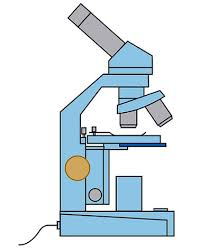
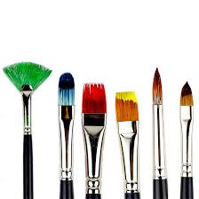

<html lang="en">
<head>
  <meta charset="utf-8" />
  <meta name="viewport" content="width=device-width, initial-scale=1" />
  <title>Knowledge Tree — Welcome</title>
  <meta name="description" content="Welcome to Knowledge Tree — a personal catalog of topics across science, history, religion, technology, art, and more." />

  
</head>

<body>
  <main class="wrap">
    <section class="hero">
      <!-- Put your header image here -->
      

        
        

          <h1>Knowledge Tree</h1>
          
A living catalog of whatever I’m curious about — updated often.

        

      

      

        <h2>Welcome Letter</h2>

        

          

            Welcome to Knowledge Tree, where I collect information on everything and anything I find interest in.
            I believe that everything around is important whether it is science, history, religion, technology, art, etc.
            I will catalog everything and anything I happen to find an interest in. The entries get updated almost daily,
            so keep an eye out for that!
          

          

            If you are interested in specific topics, I am going to work on a way to communicate with me and I can make them priorities!
          

          

            I hope whoever stumbles onto this website, enjoys what they find.
          

          

            Sincerely, 
            The Author
          

        

        <!-- Optional topic image tiles -->
        

          

            
            
Science

          

          

            
            
History

          

          

            
            
Art

          

        

        

          <strong>Image directory:</strong> put images in <code>assets/</code> next to this HTML file (or adjust the <code>src</code> paths).
        

      

    </section>
  </main>
</body>
</html>